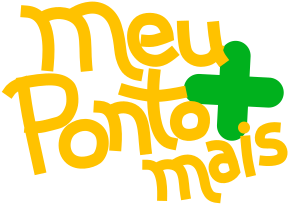

<h2 align="center">MeuPontoMais</h2>

MeuPontoMais é uma **extensão web** de **código aberto** feita para ajudar aqueles que utilizam o PontoMais no rastreio do seu dia de trabalho.

## Funcionalidades

- Rastreio de quantas horas já foram trabalhadas e de quantas faltam
- Indica qual a hora que você pode sair do trabalho
- Lista os horários dos pontos batidos durante seu turno daquele dia
